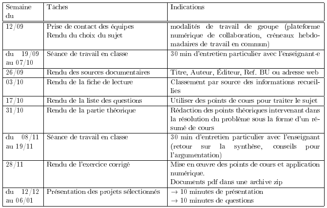

Calendrier des projets
======================
La limite des envois est le dimanche de la semaine mentionnée, à 23h59.

```{note}
Par exemple, le choix du sujet et la composition des équipes doivent
être envoyés au plus tard le dimanche 18 septembre à 23h59.
```


**Aucune dérogation n’est permise.**

Tous les rendus doivent être déposés dans la boite de dépôt eCampus
dédiée à chaque groupe de TD.

Les courriels aux enseignant·es doivent **impérativement mentionner dans
leur objet la mention MTMP100 suivie du groupe de TP**, faute de quoi
leur traitement rapide n’est pas garanti.



<table>
<thead>
<tr class="header">
<th style="text-align: left;">Semaine du</th>
<th style="text-align: left;">Tâches</th>
<th style="text-align: left;">Indications</th>
</tr>
</thead>
<tbody>
<tr class="odd">
<td style="text-align: left;">12/09</td>
<td style="text-align: left;"><p>Prise de contact des équipes</p>
<p>Rendu du choix du sujet</p></td>
<td style="text-align: left;">modalités de travail de groupe (plateforme numérique de collaboration, créneaux hebdomadaires de travail en commun)</td>
</tr>
<tr class="even">
<td style="text-align: left;">du 19/09 au 07/10</td>
<td style="text-align: left;">Séance de travail en classe</td>
<td style="text-align: left;">30 min d’entretien particulier avec l’enseignante</td>
</tr>
<tr class="odd">
<td style="text-align: left;">26/09</td>
<td style="text-align: left;">Rendu des sources documentaires</td>
<td style="text-align: left;">Titre, Auteur, Éditeur, Ref. BU ou adresse web</td>
</tr>
<tr class="even">
<td style="text-align: left;">03/10</td>
<td style="text-align: left;">Rendu de la fiche de lecture</td>
<td style="text-align: left;">Classement par source des informations recueillies</td>
</tr>
<tr class="odd">
<td style="text-align: left;">17/10</td>
<td style="text-align: left;">Rendu de la liste des questions</td>
<td style="text-align: left;">Utiliser des points de cours pour traiter le sujet</td>
</tr>
<tr class="even">
<td style="text-align: left;">31/10</td>
<td style="text-align: left;">Rendu de la partie théorique</td>
<td style="text-align: left;">Rédaction des points théoriques intervenant dans la résolution du problème sous la forme d’un résumé de cours</td>
</tr>
<tr class="odd">
<td style="text-align: left;">du 08/11 au 19/11</td>
<td style="text-align: left;">Séance de travail en classe</td>
<td style="text-align: left;">30 min d’entretien particulier avec l’enseignant (retour sur la synthèse, conseils pour l’argumentation)</td>
</tr>
<tr class="even">
<td style="text-align: left;">28/11</td>
<td style="text-align: left;">Rendu de l’exercice corrigé</td>
<td style="text-align: left;"><p>Mise en œuvre des points de cours et application numérique.</p>
<p>Documents pdf dans une archive zip</p></td>
</tr>
<tr class="odd">
<td style="text-align: left;">du 12/12 au 06/01</td>
<td style="text-align: left;">Présentation des projets sélectionnés</td>
<td style="text-align: left;"><p><span class="math inline">→</span> 10 minutes de présentation</p>
<p><span class="math inline">→</span> 10 minutes de questions</p></td>
</tr>
</tbody>
</table>


